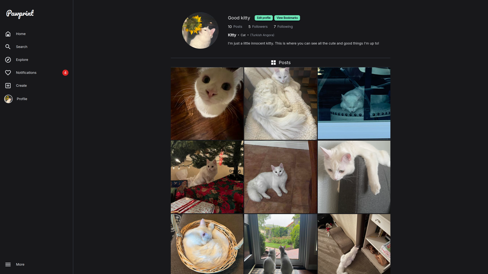
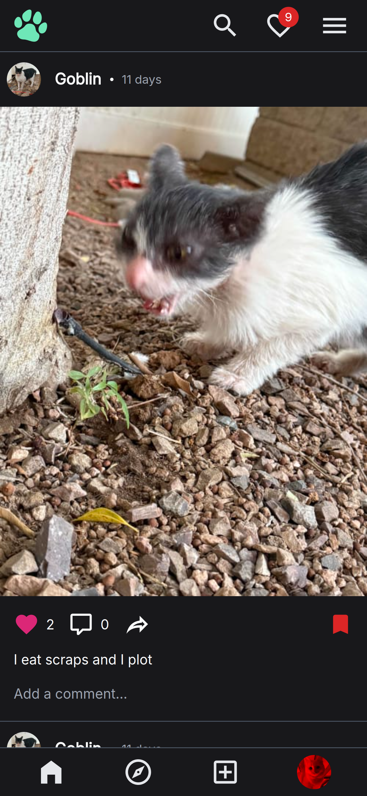
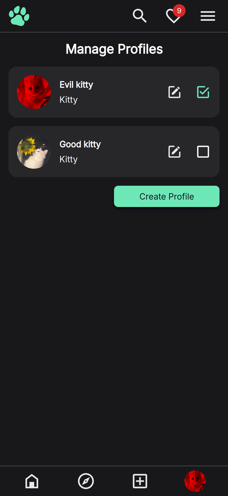
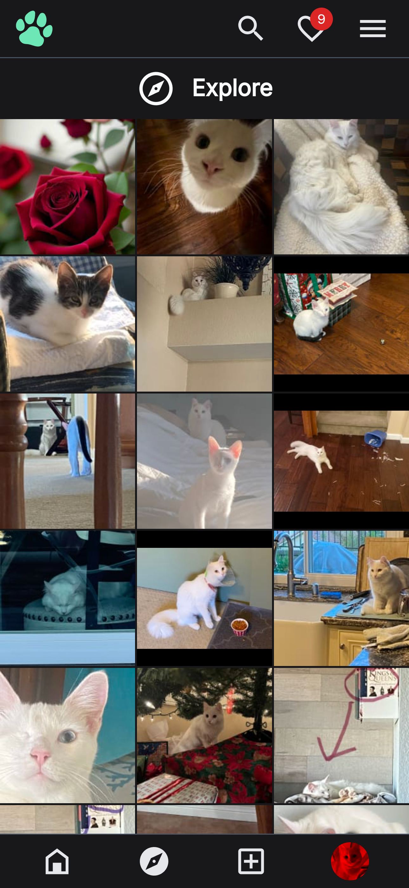

<!-- Improved compatibility of back to top link: See: https://github.com/othneildrew/Best-README-Template/pull/73 -->

<a id="readme-top"></a>

<!--
*** Thanks for checking out the Best-README-Template. If you have a suggestion
*** that would make this better, please fork the repo and create a pull request
*** or simply open an issue with the tag "enhancement".
*** Don't forget to give the project a star!
*** Thanks again! Now go create something AMAZING! :D
-->

<!-- PROJECT SHIELDS -->
<!--
*** I'm using markdown "reference style" links for readability.
*** Reference links are enclosed in brackets [ ] instead of parentheses ( ).
*** See the bottom of this document for the declaration of the reference variables
*** for contributors-url, forks-url, etc. This is an optional, concise syntax you may use.
*** https://www.markdownguide.org/basic-syntax/#reference-style-links
-->

<!-- PROJECT LOGO -->
<br />
<div align="center">
  <a href="https://github.com/Ben-Long50/pawprint-frontend.git">
    
  </a>

<h1 align="center">Pawprint</h1>

  <p align="center">
    A fullstack Instagram-like social media website
    <br />
    <a href="https://github.com/Ben-Long50/pawprint-frontend.git"><strong>Explore the docs »</strong></a>
    <br />
    <br />
    <a href="https://pawprint-social.com/">View Demo</a>
    ·
    <a href="https://github.com/Ben-Long50/pawprint-frontend/issues/new?labels=bug&template=bug-report---.md">Report Bug</a>
    ·
    <a href="https://github.com/Ben-Long50/pawprint-frontend/issues/new?labels=enhancement&template=feature-request---.md">Request Feature</a>
  </p>
</div>

<!-- TABLE OF CONTENTS -->
<details>
  <summary>Table of Contents</summary>
  <ol>
    <li>
      <a href="#about-the-project">About The Project</a>
      <ul>
        <li><a href="#built-with">Built With</a></li>
        <li><a href="#features">Features</a></li>
      </ul>
    </li>
    <li>
      <a href="#getting-started">Getting Started</a>
      <ul>
        <li><a href="#prerequisites">Prerequisites</a></li>
        <li><a href="#installation">Installation</a></li>
      </ul>
    </li>
    <li><a href="#contact">Contact</a></li>
  </ol>
</details>

<!-- ABOUT THE PROJECT -->

## About The Project

<div style="background-color: darkslategray; padding: 1rem; display: flex; flex-direction: column; gap: 1rem">
  <a href="https://pawprint-social.com">
    
  </a>
<div style="display: flex; justify-content: space-between; align-items: center; gap:1.5rem;">
  <a href="https://pawprint-social.com">
    
  </a>
  <a href="https://pawprint-social.com">
    
  </a>
  <a href="https://pawprint-social.com">
    
  </a>
</div>
</div>
<p style="margin-top: 1rem" align="right">(<a href="#readme-top">back to top</a>)</p>

### Built With

- <a style="vertical-align: middle; margin:0 1rem 1rem 0;"  href="https://reactjs.org/"></a> <a style="color: inherit; " href="https://reactjs.org/">React</a>
- <a style="vertical-align: middle; margin-right:1rem" href="https://vite.dev/"></a> <a style="color: inherit; " href="https://vite.dev/">Vite</a>
- <a style="vertical-align: middle; margin-right:1rem"  href="https://tanstack.com/query/latest"></a> <a style="color: inherit; " href="https://tanstack.com/query/latest">Tanstack Query</a>
- <a style="vertical-align: middle; margin-right:1rem" href="https://reactrouter.com/"></a> <a style="color: inherit; " href="https://reactrouter.com/">React Router</a>
- <a style="vertical-align: middle; margin-right:1rem" href="https://tailwindcss.com/"></a> <a style="color: inherit; " href="https://tailwindcss.com/">Tailwind</a>

<p style="margin-top: 1rem" align="right">(<a href="#readme-top">back to top</a>)</p>

<!-- FEATURES -->

### Features

- Multiple session based authentication methods implemented with passport.js including local login, google OAuth login, and Facebook login
- Multi-profile management under one account. Seamlessly switch between independent profiles without the need to logout and log back in
- Full profile customization including profile picture
- One click app access with guest account creation. Guest accounts allow for a fully featured app experience and are permenantly deleted on logout or after 4 hours, along with all content created on them
- Personal feed customization through profile following
- Explore page, showcasing posts from profiles which are not currently being followed
- Like, comment on and share posts with friends. A robust notification system ensures your app activity won't go unnoticed
- Fully responsive design which looks great on any screensize, mobile and desktop
<p style="margin-top: 1rem" align="right">(<a href="#readme-top">back to top</a>)</p>

<!-- GETTING STARTED -->

## Getting Started

To access the live version of this project and explore all of it's features, use the official website link below:

- <a style="vertical-align: middle; margin:0 1rem 1rem 0;"  href="https://pawprint-social.com/"></a> <a style="color: inherit; " href="https://pawprint-social.com/">Pawprint</a>

If you would like to instead run the project locally, follow the instructions listed in the remainder of this section.

### Prerequisites

1. You will first need to clone the backend API repo and run it. Please take a look at the instructions regarding the backend API in the following link:

   <a href="https://github.com/Ben-Long50/pawprint-backend.git"><strong>Pawprint API repo »</strong></a>

### Installation

1. **Clone the Repository**  
   Run the following command to clone the repository:
   ```sh
   git clone https://github.com/Ben-Long50/pawprint-frontend.git
   ```
2. **Navigate to the Project Directory and Install Dependencies**  
   Move into the project directory and install the required npm packages:
   ```sh
   cd pawprint-frontend
   npm install
   ```
3. **Set Up Environment Variables**  
   Create a .env file in the project’s base directory and add the following environment variable:
   ```js
   VITE_API_URL = 'http://localhost:3000';
   ```
4. **Avoid Accidental Pushes to the Original Repository**  
   If you plan to make changes, update the Git remote to point to your own fork to prevent accidental pushes to the base repository:

   ```sh
   git remote set-url origin https://github.com/<your_github_username>/pawprint-frontend.git
   ```

   Confirm the change:

   ```sh
   git remote -v
   ```

   You should see:

   ```sh
   origin  https://github.com/<your_github_username>/pawprint-frontend.git (fetch)
   origin  https://github.com/<your_github_username>/pawprint-frontend.git (push)
   ```

5. **Start the Development Server**  
   Run the following command to start the app:
   ```sh
   npm run dev
   ```

<p style="margin-top: 1rem" align="right">(<a href="#readme-top">back to top</a>)</p>

<!-- CONTACT -->

## Contact

Ben Long - [LinkedIn](https://www.linkedin.com/in/ben-long-4ba566129/)

Email - benjlong50@gmail.com

Project Link: [https://github.com/Ben-Long50/pawprint-frontend](https://github.com/Ben-Long50/pawprint-frontend)

<p style="margin-top: 1rem" align="right">(<a href="#readme-top">back to top</a>)</p>

<!-- MARKDOWN LINKS & IMAGES -->
<!-- https://www.markdownguide.org/basic-syntax/#reference-style-links -->

[contributors-shield]: https://img.shields.io/github/contributors/github_username/repo_name.svg?style=for-the-badge
[contributors-url]: https://github.com/github_username/repo_name/graphs/contributors
[forks-shield]: https://img.shields.io/github/forks/github_username/repo_name.svg?style=for-the-badge
[forks-url]: https://github.com/github_username/repo_name/network/members
[stars-shield]: https://img.shields.io/github/stars/github_username/repo_name.svg?style=for-the-badge
[stars-url]: https://github.com/github_username/repo_name/stargazers
[issues-shield]: https://img.shields.io/github/issues/github_username/repo_name.svg?style=for-the-badge
[issues-url]: https://github.com/github_username/repo_name/issues
[license-shield]: https://img.shields.io/github/license/github_username/repo_name.svg?style=for-the-badge
[license-url]: https://github.com/github_username/repo_name/blob/master/LICENSE.txt
[linkedin-shield]: https://img.shields.io/badge/-LinkedIn-black.svg?style=for-the-badge&logo=linkedin&colorB=555
[linkedin-url]: https://www.linkedin.com/in/ben-long-4ba566129/
